# Experiment Dossier

This document is the research-facing description of `agents_scaling`: what scientific
question the harness asks, what systems are compared, how they are run, and how the
measurements answer the question.

For implementation details, see [ARCHITECTURE.md](ARCHITECTURE.md). For cluster
operations, see [OPERATIONS.md](OPERATIONS.md). For exact JSON fields, see
[DATA_SCHEMA.md](DATA_SCHEMA.md).

## Objective

The central question is:

> Does multi-agent coordination amplify or correct per-agent miscalibration?

The repo follows the topology framing of Kim et al., "Towards a Science of Scaling Agent
Systems" (arXiv:2512.08296), but changes the measurement target. Kim et al. study
closed-API agent systems and quantify performance and coordination efficiency. This
harness uses open-weight Qwen3 models served through vLLM so that logits, option
probabilities, reasoning traces, and token accounting can be measured directly.

The headline estimand is:

```text
Delta ECE = system-level ECE - mean per-agent ECE
```

where ECE is expected calibration error. Positive Delta ECE means the system's final
answer confidence is less calibrated than its component agents; negative Delta ECE means
coordination improved calibration.

## Research Questions

The full sweep varies four scaling axes while holding the benchmark, topology, and fixed
runtime knobs explicit in every `ExperimentCell`.

| Axis | Research question | Controlled knob | Measured attribute |
|---|---|---|---|
| Model capacity | Do larger open-weight base models reduce individual and system miscalibration, and does the coordination effect change with scale? | Qwen3 dense size | Parameter count |
| Context sharing | Does exposing more peer work help agents correct errors, or does it propagate overconfident mistakes? | `artifact_only`, `plus_intermediate`, `plus_cot` | Shared context length |
| Prompt complexity | Do more elaborate role/strategy/calibration prompts improve accuracy and calibration, or mostly add instruction overhead? | Prompt level `L0..L3` | Prompt tokens and prompt-quality score |
| Reasoning capacity | Does native Qwen3 thinking make agents better calibrated, and does a team compound or correct the resulting confidence signal? | `off`, `b512`, `b2048`, `b8192`, `unlimited` | Mean reasoning tokens |

The resulting analyses ask the same question at three levels:

1. Performance: which cells answer correctly?
2. Efficiency: what accuracy is obtained per coordination cost?
3. Calibration: is the final system confidence more or less calibrated than the agents
   that produced it?



Source: [figures/experimental_design.mmd](figures/experimental_design.mmd).

## Experimental Grid

The main grid is defined in `configs/full_sweep.yaml`.

| Dimension | Values |
|---|---|
| Model size | `0.6B`, `1.7B`, `4B`, `8B`, `14B`, `32B` |
| Topology | `single_agent`, `independent`, `decentralized`, `centralized` |
| Context sharing | `artifact_only`, `plus_intermediate`, `plus_cot` |
| Prompt level | `0`, `1`, `2`, `3` |
| Reasoning level | `off`, `b512`, `b2048`, `b8192`, `unlimited` |
| Benchmark | `gpqa`, `mmlu_pro`, `math`, `truthfulqa` |
| Seed | `0`, `1`, `2` |

Fixed defaults for the headline sweep:

| Knob | Value | Meaning |
|---|---:|---|
| `n_agents` | 3 | Number of agents in multi-agent topologies |
| `rounds` | 2 | Debate/orchestration rounds |
| `n_samples` | 5 | Samples for self-consistency signals in single-agent cells |
| `temperature` | 0.7 | Default chat sampling temperature when thinking is off |
| `n_questions` | 200 | Questions per cell |

The raw cross-product is canonicalized by `sweep.generate_cells()`:

- `single_agent` and `independent` do not consume peer context, so context sharing is
  collapsed to `artifact_only`.
- `single_agent` rounds collapse to one.
- A matched `single_agent` baseline is enforced for each `(model_size, benchmark, seed,
  reasoning_level)` so efficiency ratios are computed against the correct baseline.

## Models And Serving

All primary cells use one model family, Qwen3 dense, to isolate parameter count while
keeping tokenizer, architecture family, and hybrid-thinking support fixed.

| Size | Hugging Face ID | Params (B) | TP size | Max model len | Reasoning |
|---|---|---:|---:|---:|---|
| `0.6B` | `Qwen/Qwen3-0.6B` | 0.6 | 1 | 32768 | yes |
| `1.7B` | `Qwen/Qwen3-1.7B` | 1.7 | 1 | 32768 | yes |
| `4B` | `Qwen/Qwen3-4B` | 4.0 | 1 | 32768 | yes |
| `8B` | `Qwen/Qwen3-8B` | 8.2 | 1 | 32768 | yes |
| `14B` | `Qwen/Qwen3-14B` | 14.8 | 1 | 32768 | yes |
| `32B` | `Qwen/Qwen3-32B` | 32.8 | 1 | 16384 | yes |

Serving uses one or more long-lived vLLM jobs per model size. Each job launches:

```bash
vllm serve <hf_id> \
  --served-model-name <size> \
  --tensor-parallel-size <tp_size> \
  --gpu-memory-utilization 0.90 \
  --max-model-len <max_model_len> \
  --max-logprobs 20 \
  --reasoning-parser qwen3
```

After the server passes `/health` and `/v1/models`, it writes a registry entry under the
run directory. CPU cell workers discover an endpoint by model size and use the
OpenAI-compatible `/v1` API. Multiple endpoints for the same size are supported and are
round-robined by cell index.



Source: [figures/execution_architecture.mmd](figures/execution_architecture.mmd).

## Agent Systems

The repo implements four topologies. Kim et al. also describe Hybrid; this harness does
not implement Hybrid and does not include it in the sweep.



Source: [figures/topologies.mmd](figures/topologies.mmd). The design is recreated for
this repo from the topology definitions in Kim et al.; copied paper figures are not
committed because the arXiv source uses the arXiv non-exclusive distribution license, not
a repo-friendly reuse license. See
[figures/source/kim_et_al_2026/README.md](figures/source/kim_et_al_2026/README.md).

| Topology | Agents | Default rounds | Communication | Final answer | System-confidence view |
|---|---:|---:|---|---|---|
| `single_agent` | 1 | 1 | None | Sole agent answer | Sole producer confidence |
| `independent` | 3 | 1 | None before vote | Majority vote; ties by summed option mass | Vote fraction, agreeing confidence, final producer |
| `decentralized` | 3 | 2 | All agents see other agents' previous-round outputs | Majority vote over final round | Vote fraction, agreeing confidence, final producer |
| `centralized` | 3 | 2 | Sub-agents send to orchestrator; later rounds see orchestrator synthesis | Orchestrator answer | Orchestrator/final producer confidence |

All communicating topologies route peer text through `build_peer_context()`. This is what
makes context sharing an experimental knob rather than topology-specific string handling.

The per-question execution path is:



Source: [figures/per_question_flow.mmd](figures/per_question_flow.mmd).

## Context Sharing

The context-sharing axis controls what fields of a peer `AgentOutput` are visible:

| Level | Peer fields shared | Interpretation |
|---|---|---|
| `artifact_only` | Final answer and stated confidence | The system sees conclusions only |
| `plus_intermediate` | Artifact plus scratchpad/sub-conclusions | The system sees compact reasoning artifacts |
| `plus_cot` | Intermediate context plus raw CoT/native reasoning trace | The system sees the most private reasoning signal |

The levels are nested by construction. `plus_cot` is truncated to control context growth.

## Prompt Complexity

Prompt levels live in `configs/prompts/level0.txt` through `level3.txt`.

| Level | Description | Intended manipulation |
|---|---|---|
| L0 | Minimal helpful-assistant instruction | Low instruction load |
| L1 | Expert role and answer-format guidance | Standard baseline prompt |
| L2 | Step-by-step strategy and elimination guidance | Explicit problem-solving procedure |
| L3 | Full strategy, calibration instruction, output format, worked example | Maximum instruction and calibration scaffolding |

The runner records both token count and prompt-quality features in `meta.json` so the
analysis can separate "longer prompt" from "better prompt".

## Reasoning Protocol

Qwen3 thinking mode is not measured with the same generation call used for the final
option probability. When reasoning is enabled, each agent uses a two-call protocol:

1. A thinking chat call captures the answer text, native reasoning trace, completion
   tokens, and approximate reasoning tokens.
2. A forced-answer probe on the completions endpoint reads the option-letter logprob
   distribution after a prompt ending in `Answer: `.

This keeps calibration on a deterministic option-scoring path while still varying
reasoning depth.



Source: [figures/reasoning_ece_protocol.mmd](figures/reasoning_ece_protocol.mmd).

## Benchmarks And Grading

| Benchmark | Source | Answer type | Grading | Calibration notes |
|---|---|---|---|---|
| GPQA-Diamond | `Idavidrein/gpqa`, `gpqa_diamond` | MCQ | Option letter after deterministic option shuffle | Option-logprob ECE is native; dataset is gated |
| MMLU-Pro | `TIGER-Lab/MMLU-Pro`, test | MCQ | Option letter after deterministic option shuffle | Option-logprob ECE is native |
| TruthfulQA-MC1 | `truthfulqa/truthful_qa`, multiple-choice validation | MCQ | Single correct MC1 option | Option-logprob ECE is native |
| MATH-500 | `HuggingFaceH4/MATH-500`, test | Numeric/free form | Last boxed answer or normalized final text | MCQ option-logprob ECE is not native; use available verbal/sample signals carefully |

Every loader emits a common `Question` schema. MCQ option order is shuffled
deterministically from the seed so correct answers do not occupy a fixed letter.

## Measurements

### Performance

Performance is task accuracy per cell:

```text
accuracy = mean(correct)
error_rate = 1 - accuracy
```

### Efficiency

Efficiency follows the Kim et al. coordination metrics relative to the matched
single-agent baseline:

| Metric | Meaning |
|---|---|
| `Ec` | Coordination efficiency: success per relative turn cost |
| `Ae` | Error amplification: MAS error rate divided by single-agent error rate |
| `O%` | Turn overhead relative to single-agent |
| `c` | Message density: inter-agent messages per reasoning turn |
| `R` | Redundancy: mean pairwise similarity of agent outputs when embeddings are available |

The harness also logs token and wall-clock counters because open-weight serving gives
direct cost observability.

### Calibration

Calibration is computed from paired `(confidence, correct)` observations using ECE, MCE,
and Brier score. ECE uses 15 equal-width bins by default.

The analysis computes:

| Scope | Confidence signal |
|---|---|
| Per-agent | Option probability assigned to the agent's own chosen answer |
| System pooled | Vote fraction, mean agreeing logprob, mean agreeing verbal confidence, mean all-agent logprob |
| Final producer | Confidence of the model output that determined the final system answer |
| Single-agent samples | Self-consistency and semantic-entropy confidence where available |

The main comparison is system calibration versus the distribution of individual agent
calibration under the same cell conditions.

## Analysis Pipeline

Each completed cell writes one `results.jsonl` row per question and one `meta.json` file
per cell. Aggregation turns those into one tidy row per cell, then notebooks or examples
compute scaling curves, regressions, and reliability diagrams.



Source: [figures/analysis_pipeline.mmd](figures/analysis_pipeline.mmd).

The intended result views are:

- Accuracy, efficiency, and ECE versus model size.
- Delta ECE versus context-sharing level.
- Accuracy/ECE versus prompt level and measured prompt attributes.
- Accuracy/ECE/cost versus reasoning level and mean reasoning tokens.
- Topology-faceted reliability diagrams.
- Kim-style regression with model capacity, context rank, prompt complexity, reasoning
  rank, and topology indicators.

## Reading Results

Pilot values in [RESULTS.md](RESULTS.md) are validation signals, not final claims. The
full sweep is designed to answer:

- Whether increasing model capacity improves individual calibration faster than system
  calibration.
- Whether coordination can make a confident wrong majority more likely.
- Whether exposing intermediate reasoning improves verification or spreads error.
- Whether native thinking increases accuracy at the cost of overconfidence.
- Whether final-producer confidence behaves differently from pooled vote confidence.

Claims should be made from completed, aggregated cells with matched baselines present.
